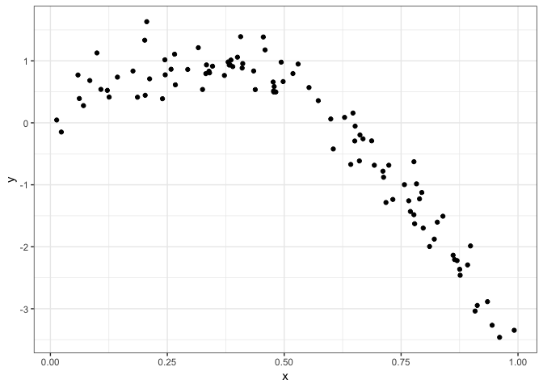
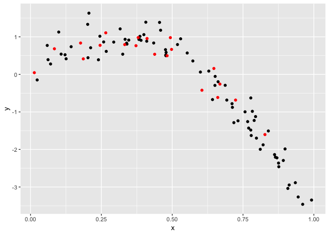
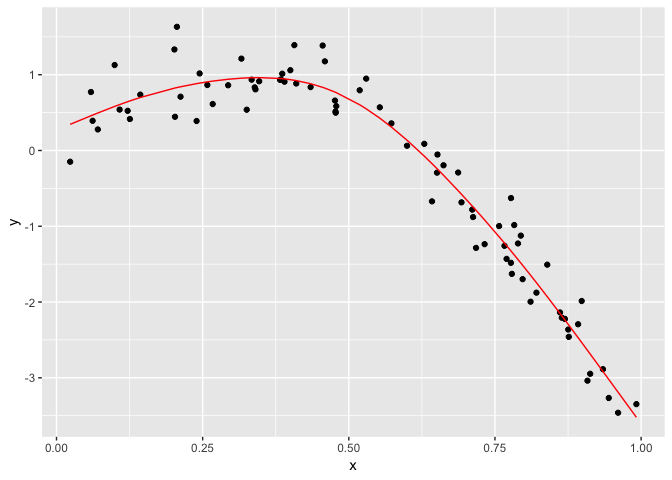
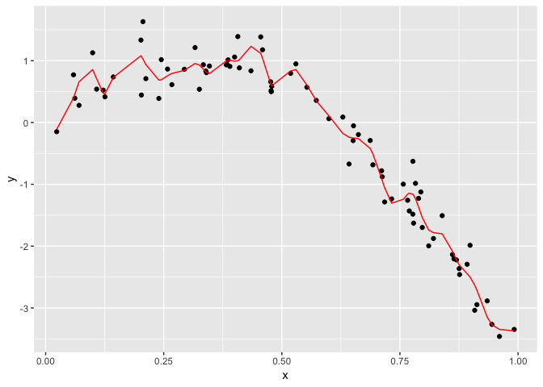
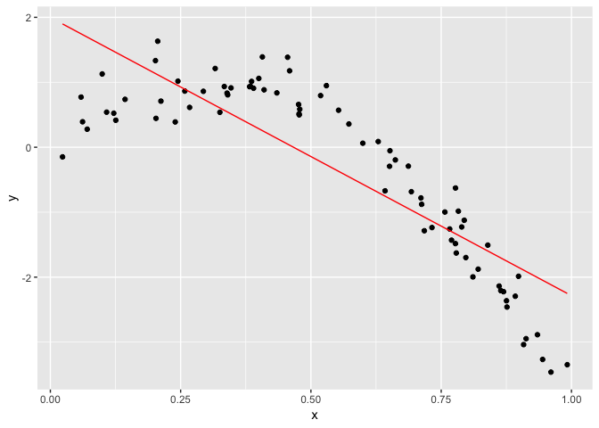
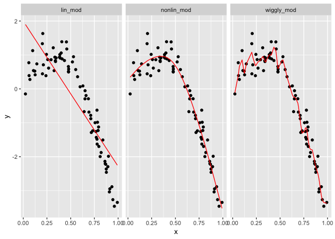

Cross validation
================
Annie Yu (xy2404)
11/13/2018

``` r
nonlin_df = tibble(
  id = 1:100,
  x = runif(100, 0, 1),
  y = 1 - 10 * (x - .3) ^ 2 + rnorm(100, 0, .3)
)

ggplot(nonlin_df, aes(x = x, y = y)) + geom_point() + theme_bw()
```



Partition into training and testing

``` r
train_df = sample_n(nonlin_df, 80)
test_df = anti_join(nonlin_df, train_df, by = "id")

ggplot(train_df, aes(x = x, y = y)) + 
  geom_point() + 
  geom_point(data = test_df, color = "red")
```



fit a few model

``` r
lin_mod = lm(y ~ x, data = train_df)
nonlin_mod = mgcv::gam(y ~ s(x), data = train_df)
wiggly_mod = mgcv::gam(y ~ s(x, k = 30), sp = 10e-6, data = train_df)
```

Show what these look like:

``` r
train_df %>% 
  add_predictions(nonlin_mod) %>%  # the model of nonline
  ggplot(aes(x = x, y = y)) + geom_point() + 
  geom_line(aes(y = pred), color = "red")
```



``` r
train_df %>% 
  add_predictions(wiggly_mod) %>%  # the model of wiggle
  ggplot(aes(x = x, y = y)) + geom_point() + 
  geom_line(aes(y = pred), color = "red")
```



``` r
train_df %>% 
  add_predictions(lin_mod) %>% 
  ggplot(aes(x = x, y = y)) + geom_point() + 
  geom_line(aes(y = pred), color = "red")
```



Make all the plots togather

``` r
train_df %>% 
  gather_predictions(lin_mod, nonlin_mod, wiggly_mod) %>%  #gather_predictation function: make all the model tohgether
  mutate(model = fct_inorder(model)) %>% 
  ggplot(aes(x = x, y = y)) + 
  geom_point() + 
  geom_line(aes(y = pred), color = "red") + 
  facet_wrap(~model)
```



Compute root mean squared errors (RMSEs) for each model.

``` r
rmse(lin_mod,test_df) #rmse: compute root mean squared errors [rmse(model, data)]
```

    ## [1] 0.7163422

``` r
rmse(nonlin_mod, test_df)
```

    ## [1] 0.2437012

``` r
rmse(wiggly_mod, test_df)
```

    ## [1] 0.3471883
